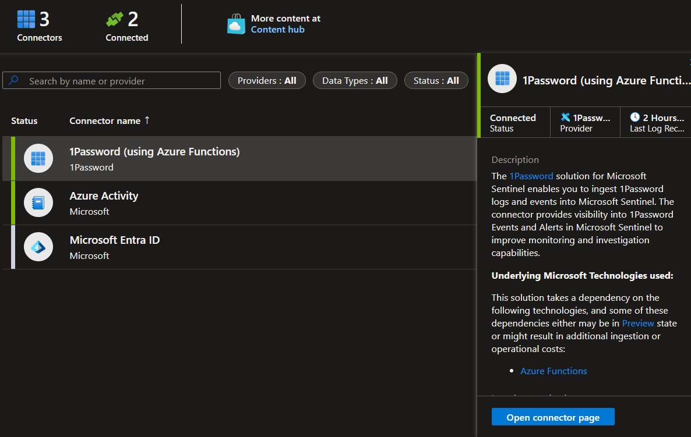
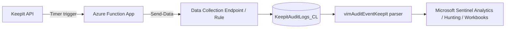

# KeepIt - Microsoft Sentinel solution



## Introduction

The **KeepIt** solution for Microsoft Sentinel ingests audit events from the [KeepIt](https://www.keepit.com) backup and data protection platform into Microsoft Sentinel, giving you visibility into KeepIt activities, admin actions, and access events for monitoring, detection, and investigation.

The solution deploys an Azure Function App that polls the KeepIt Audit API on a timer, normalizes the returned records, and ingests them into a custom Log Analytics table via a Data Collection Rule (DCR). A Microsoft Sentinel data connector and an ASIM parser are included so the data can be used directly in analytics rules, workbooks, and hunting queries.

## Architecture

| Component | Description |
|---|---|
| **Azure Function App** (PowerShell, timer trigger) | Authenticates to the KeepIt API, retrieves audit logs on a schedule, and forwards parsed records to the ingestion pipeline. |
| **Data Collection Endpoint (DCE) / Data Collection Rule (DCR)** | Receives the parsed records from the Function App and transforms/routes them into the custom Log Analytics table. |
| **Custom Log Analytics table** (`KeepitAuditLogs_CL`) | Stores the raw ingested KeepIt audit events. |
| **Microsoft Sentinel Data Connector** | Provides the connector UI in Sentinel, including sample queries and connectivity checks. |
| **ASIM Parser** (`vimAuditEventKeepIt`) | Normalizes `KeepitAuditLogs_CL` records into the ASIM `AuditEvent` schema for use in built-in analytics rules and hunting queries. |



## Prerequisites

- A Microsoft Sentinel workspace (Log Analytics workspace with Sentinel enabled).
- A KeepIt account with API access, including:
  - Account name
  - Login name
  - Password
  - The KeepIt API host for your region (for example `https://de-fr.keepit.com`)
- Permissions to deploy Azure resources (Function App, Data Collection Endpoint/Rule, Log Analytics table) in the target subscription and resource group.

## Deployment

The solution can be deployed from the Microsoft Sentinel Content Hub, or manually using the ARM templates in this repository:

1. Deploy [Package/mainTemplate.json](Package/mainTemplate.json) (or [Data Connectors/KeepIt/azuredeploy_KeepIt_API_FunctionApp.json](Data%20Connectors/KeepIt/azuredeploy_KeepIt_API_FunctionApp.json)) to your subscription.
2. Provide the target Log Analytics workspace name and your KeepIt account credentials when prompted.
3. The template deploys, in order:
   - The custom table, Data Collection Endpoint, and Data Collection Rule ([KeepIt_custom_table.json](Data%20Connectors/KeepIt/deployment/KeepIt_custom_table.json))
   - The Function App that ingests KeepIt audit events ([KeepIt_function_app.json](Data%20Connectors/KeepIt/deployment/KeepIt_function_app.json))
   - The Microsoft Sentinel data connector ([KeepIt_data_connector.json](Data%20Connectors/KeepIt/deployment/KeepIt_data_connector.json))
4. After deployment, verify data is flowing into `KeepitAuditLogs_CL` and that the data connector shows as connected in Microsoft Sentinel.

## Parser

See [Data Connectors/KeepIt/Parsers/README.md](Data%20Connectors/KeepIt/Parsers/README.md) for full details on the `vimAuditEventKeepIt` ASIM parser, its column mappings, and troubleshooting steps.

## Repository structure

```
Data Connectors/KeepIt/   Function App source, deployment templates, and parser
Package/                  Solution package (mainTemplate.json, createUiDefinition.json)
Analytics Rules/          Solution analytics rules
images/                   Screenshots used in this README and the Content Hub listing
```

## Release notes

See [ReleaseNotes.md](ReleaseNotes.md) for version history.

## Support

This solution is community-supported. See [SolutionMetadata.json](SolutionMetadata.json) for support contact details, or open an issue in this repository.